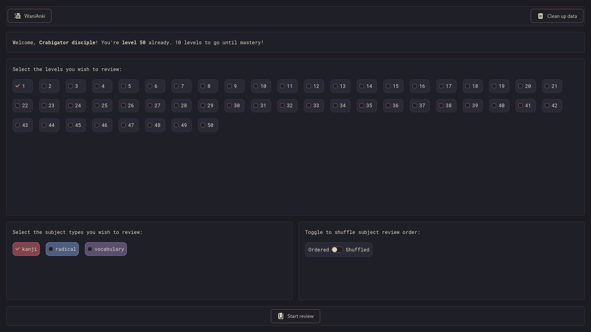
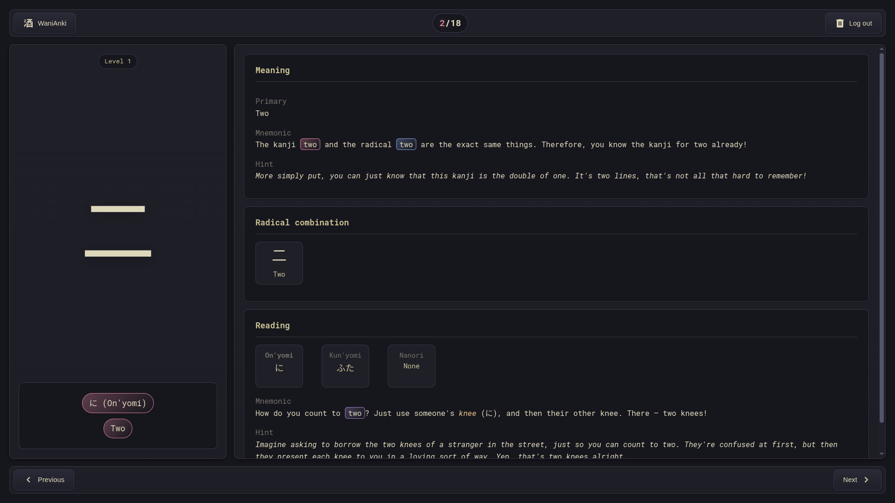
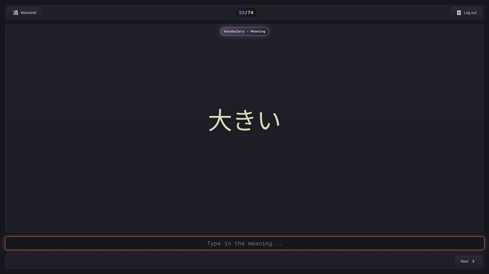

# WaniAnki

A lightweight web application that **fetches review subjects from your WaniKani account and lets you review them offline**. All review data is persisted locally using the browser **Origin Private File System (OPFS) API**, and **your API token is not retained in browser memory**. Select subjects by type (radical, kanji, vocabulary), filter by level range, or search by meaning or reading.

## Features

- 📴 **Offline reviews** — review cached subjects without an active network connection.
- 🎯 **Flexible selection** — filter by subject type and level range, search by meaning or reading, or toggle entire levels at once.
- 💾 **Local persistence** — all data is stored in-browser using the OPFS API.
- 📚 **Two review modes** — study mode for reading content, quiz mode for testing yourself.
- 🗂️ **Saved review decks** — save your current selection as a named deck and load it later for quick access.
- 🔄 **Sync with WaniKani** — sync your data when you level up to fetch new subjects while keeping your API token secure.
- 📊 **Quiz summary** — view your quiz results and create a new deck from incorrect answers to focus your practice.
- ⌨️ **Easy keyboard navigation** — use keyboard shortcuts to easily navigate through review subjects.
- 🔒 **API token safety** — the API token is not kept in memory.

## Usage


Provide a valid WaniKani personal access token with `all_data:read` permission.


Select subjects using the tabbed filter (radical, kanji, vocabulary), adjust the level range with sliders, or search by meaning or reading with autocomplete suggestions. Browse subjects grouped by level, toggle entire levels at once, or click individual items. Selected subjects appear as removable chips at the bottom. Choose ordered or shuffled review, then start in either study mode or quiz mode.

When you level up on WaniKani, use the sync button in the header to fetch your new subjects. You'll be prompted to re-enter your API token, which is used only for that request and then discarded.

## Study Mode vs Quiz Mode

### Study Mode



A read-only mode for reviewing subject details. Displays the full breakdown of each subject including meanings, mnemonics, hints, radical combinations, and readings (on'yomi, kun'yomi, nanori). Navigate freely between subjects to reinforce your memory.

### Quiz Mode



An interactive mode that tests your knowledge. You'll be prompted to type in either the meaning or reading of each subject. Answers are validated as you go — readings require an exact hiragana match, while meanings allow for close answers using fuzzy matching.

### Quiz Summary

After completing a quiz, you'll see a summary of your results with accuracy statistics broken down by subject type and quiz type. If you got any answers wrong, you can create a new deck from those items to focus your practice. When quizzing from an existing deck, you can also update that deck to contain only the items you missed.

## Keyboard Shortcuts

### Study Mode

| Action           | Shortcut                   |
| ---------------- | -------------------------- |
| Next subject     | Space; Enter               |
| Previous subject | Ctrl + Space; Ctrl + Enter |
| Exit to dashboard| Escape                     |

### Quiz Mode

| Action                     | Shortcut |
| ---------------------------| -------- |
| Submit answer / Next review| Enter    |
| Exit to dashboard          | Escape   |

## Development

```bash
npm install           # Install dependencies
npm run dev           # Start development server
npm run build         # Create production build
npm run preview       # Serve production build
npm run test          # Run the test suite
npm run lint          # Run the ES linter
npm run stylelint     # Run the style linter
npm run type-check    # Run the types check
```

## Built with

[Vue 3](https://github.com/vuejs/core/), [Vite](https://github.com/vitejs/vite/) and [TypeScript](https://github.com/microsoft/TypeScript/)

## Author

- **Pierre-Alain Castella** - _Initial work_ - [metapho-re](https://github.com/metapho-re)

## License

This project is licensed under the MIT License - see the [LICENSE](LICENSE) file for details.
