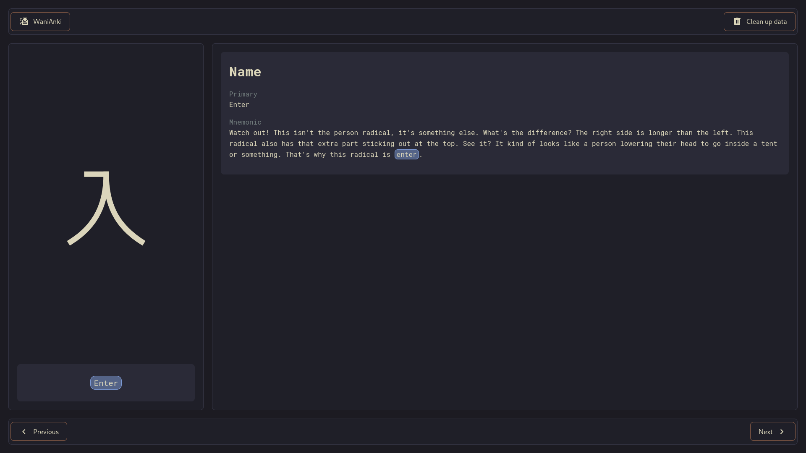
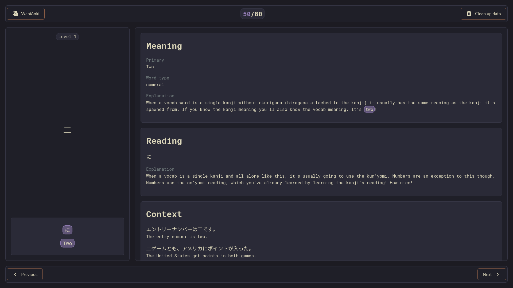

# WaniAnki

A lightweight web application that **fetches review subjects from your WaniKani account and lets you review them offline**. All review data is persisted locally using the browser **Origin Private File System (OPFS) API**, and **your API token is not retained in browser memory**. Filter and review by level and by subject type: **radical, kanji, and vocabulary**.

## Features

- **Offline reviews** — review cached subjects without an active network connection.
- **Per-level filtering** — sync and review specific levels only.
- **Subject types** — review radicals, kanji, and vocabulary.
- **Local persistence** — all data is stored in-browser using the OPFS API.
- **Easy keyboard navigation** — use keyboard shortcuts to easily navigate through review subjects.
- **Single-page subject layout** — a clean, focused layout for each review subject, aligned with WaniKani's original content structure.
- **API token safety** — the API token is not kept in memory.

## Usage

Provide a valid WaniKani personal access token with `all_data:read` permission.

Select the level(s) and subject type(s) you want to review.

Navigate through the subjects to review and master those kanji!

## Keyboard Shortcuts

| Action           | Shortcut                   |
| ---------------- | -------------------------- |
| Next subject     | Space; Enter               |
| Previous subject | Ctrl + Space; Ctrl + Enter |
| Exit review      | Escape                     |

## Installation

`npm install`

## Usage

- Start development server: `npm run dev`
- Create production build: `npm run build`
- Serve production build: `npm run preview`
- Run the ES linter: `npm run lint`
- Run the style linter: `npm run stylelint`
- Run the types check: `npm run type-check`

## Built with

[Vue 3](https://github.com/vuejs/core/), [Vite](https://github.com/vitejs/vite/) and [TypeScript](https://github.com/microsoft/TypeScript/)

## Author

- **Pierre-Alain Castella** - _Initial work_ - [metapho-re](https://github.com/metapho-re)

## License

This project is licensed under the MIT License - see the [LICENSE](LICENSE) file for details.
